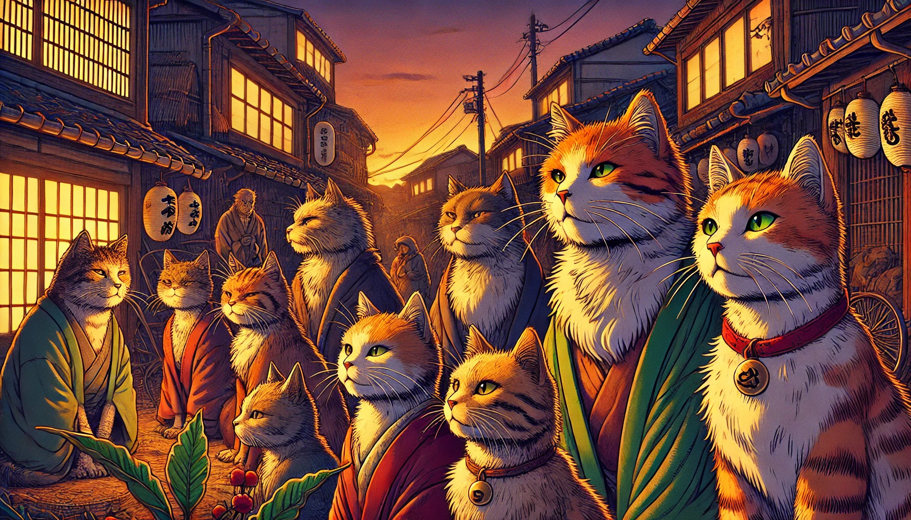

# 길고양이들의 이야기

미야자키현의 작은 마을에는 수많은 길고양이들이 살고 있다. 이 고양이들은 각기 다른 성격과 외모를 가지고 있으며, 그들만의 독특한 이야기를 가지고 있다. 어떤 고양이는 과거에 화려한 도시에서 살았던 경험을 이야기하고, 또 다른 고양이는 바다를 건너온 모험담을 자랑한다. 이들은 서로의 꿈을 나누며, 언젠가 더 큰 세상으로 나아가고 싶다는 희망을 품고 있다.

 